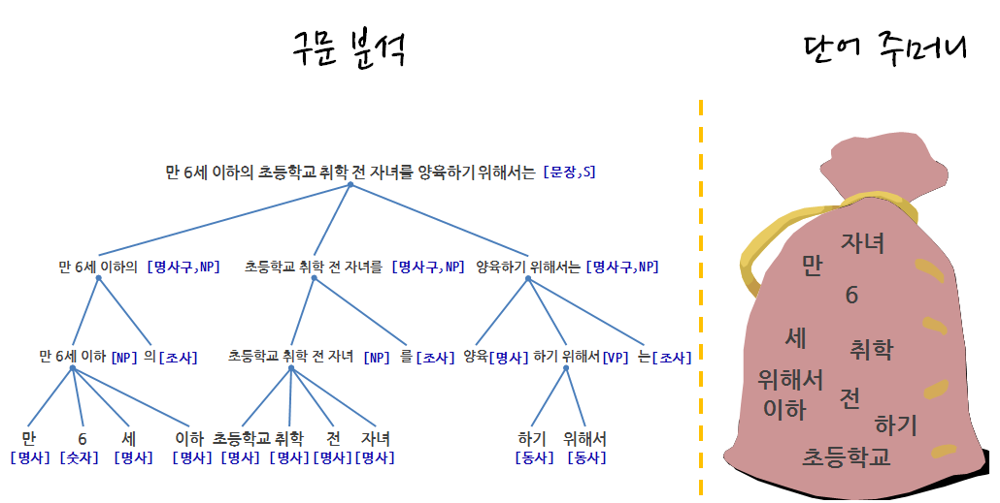

> ## 학습목표 {.objectives}
>
> * 텍스트 데이터 분석에 대해 이해한다.
> * 전통적인 텍스트 분석방법에 대응되는 단어 주머니(bag of words)에 대해 살펴본다.

### 1. 텍스트 문자 데이터 분석 작업 흐름

텍스트 문자 데이터 분석 작업 흐름도 일반적인 데이터 분석 과정과 크게 차이가 나지는 않는다.

1. 문제 정의 및 목표설정: 적용분야 전문지식 습득 필요
1. 수집 텍스트 데이터 식별: 목표달성을 위한 정보가 담긴 데이터 발굴
1. 데이터 분석 및 모형 개발 과정
    * 텍스트 데이터 전처리 및 구조화
    * 데이터 정제 및 Feature 공학을 통한 Feature 추출 
    * 데이터 분석 및 모형 개발 : 탐색적 데이터 분석 포함
1. 분석결과 정리: 보고서, 추천, 통찰 도출

### 2. 단어주머니 접근법

[**단어 주머니(bag of words)**](https://en.wikipedia.org/wiki/Bag-of-words_model) 모형은 전통적인 자연어 처리(Natural Language Processing) 혹은 
정보 검색(Information Retrieval)에서 사용되는 간략화한 표현으로 볼 수 있다. 문법 무시, 어순 무시 등 전통적인 텍스트 분석에 사용되는 것과 
달리, 각 단어가 출현된 회수를 Feature로 추출하여 문서 분류, 감정분석 등에 활용한다.

