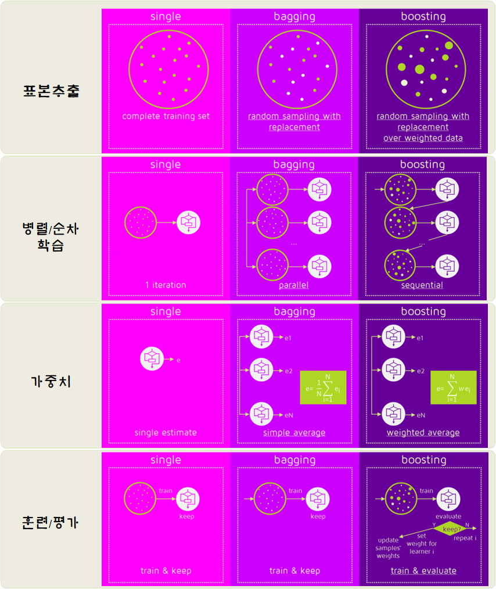
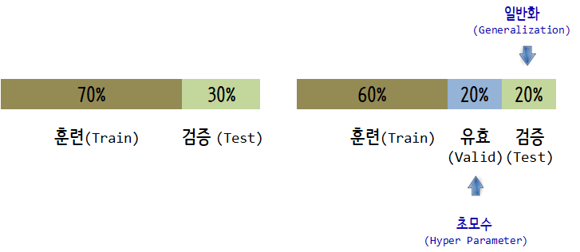
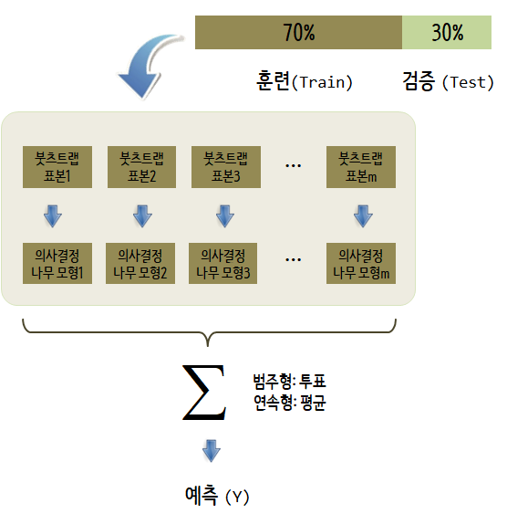

 

``` {r, include=FALSE}
source("tools/chunk-options.R")
knitr::opts_chunk$set(echo=TRUE, message=FALSE, warning=FALSE)

library(tidyverse)
library(skimr)
library(rpart)      # 재귀분할 나무모형
library(caret)      # 예측모형 플랫폼
library(Metrics)    # 예측모형 성능평가
library(ipred)      # 배깅
library(randomForest)
library(ggpubr)
library(extrafont)
loadfonts()
library(gbm)
library(ggbeeswarm)
```

# 1. 나무기반 모형  [^bagging-boosting-comparison] [^weak-learner-stacking] {#tree-based-machine-leanring-model}

[^bagging-boosting-comparison]: [Bagging and Boosting are both ensemble methods in Machine Learning, but what’s the key behind them?](https://quantdare.com/what-is-the-difference-between-bagging-and-boosting/)

[^weak-learner-stacking]: [Can a set of weak systems turn into a single strong system?](http://quantdare.com/dream-team-combining-classifiers-2/)


나무기반 모형은 통계전문가 뿐만 아니라, 컴퓨터 과학자, 사업하시는 분들에게서 사랑받는 가장 대중적인 기계학습 모형중에 하나다.
단점이 없는 모형이 없지만, 나무기반 모형은 다음 측면에서 다른 모형에 비해서 비교우위에 있는 것은 분명하다.

- 해석용이성
- 사용하기 편리함
- 정확성
- 결측값 처리 불필요

예측모형의 성능은 분산(variance)과 편향(bias)를 모두 줄여야 하는데 이를 위해서 나무기반 강력한 모형이 수십년동안 개발되었다.

- 재귀적 분할(recursive partitioning): `rpart`
- 배깅 (Bagging, **B**ootstrap **AGG**regat**ING**): `ipred`
- 랜덤 포리스트(Random Forest): `randomForest`
- GBM(Gradient Boosting Machine): `gbm`  


### 1.1. 배깅(Bagging) vs. 부스팅(Boosting) {#tree-based-bagging-vs-boosting}

배깅과 부스팅은 여러모로 비슷한 점이 있지만, 차이점도 크다.
배깅과 부스팅 모두 재귀분할 의사결정나무의 안정성을 높인다는 점에서는 공통점이 있지만,
부스팅만이 편향(Bias)를 줄일 수 있고, 배깅은 과적합 문제점에 대해서 해결책을 제공할 수 있을 뿐이다.

또한, 배깅은 독립적으로 약한 학습기를 생성시키는데 반해, 부스팅은 신규 약한 학습기를 추가할 때 이전 모형이 저지른 실수를 잘 매꿀 수 있게 추가시킨다. 마찬가지로 배깅은 임의표본추출을 하는 반면에, 부스팅은 이미 해결한 문제에 대해서는 적은 가중치를 두고, 실수를 저지른 경우에 더 높은 가중치를 두어 편향을 줄여 나간다.

이러한 사소하지만 큰 차이는 최종단계에서 총계(Aggregating)에서도 배깅은 $\frac{1}{n}$ 동일한 가중치를 주는 반면에 부스팅은 더 다은 성능을 낼 수 있는 쪽에 더 큰 가중치를 부여한다.



# 2. 재귀적 분할(recursive partitioning) {#tree-based-model-rpart}

재귀적 분할 예측모형 개발을 위해서 사전에 몇가지 팩키지를 준비한다.

- tidyverse
- skimr
- rpart      : 재귀분할 나무모형
- caret      : 예측모형 플랫폼
- [Metrics](https://github.com/mfrasco/Metrics)    : 예측모형 성능평가

UCI 기계학습 저장소에서 신용승인 데이터 [Credit Approval Data Set ](http://archive.ics.uci.edu/ml/datasets/credit+approval)을 다운로드 받아
신용승인 변수를 예측변수로 설정하고 연속형 변수 다수를 변환시킨 후에 `caret` 팩키지를 사용해서 데이터를 훈련 데이터와 검증 데이터로 나누고 나서, 재귀분할 나무 모형에 적합시킨다.

``` {r tree-based-model-rpart}
# 0. 환경설정 -----------------
# library(tidyverse)
# library(skimr)
# library(AER)        # 카드발급 데이터가 포함됨 
# library(rpart)      # 재귀분할 나무모형
# library(caret)      # 예측모형 플랫폼
# library(Metrics)    # 예측모형 성능평가
# library(ipred)      # 배깅(Bagging)
# library(randomForest)
# library(ggpubr)
# library(extrafont)
# loadfonts()
# library(ggbeeswarm)

# 1. 데이터 가져오기 ----------

data("GermanCredit") # caret 팩키지 내장

# 2. 모형데이터 준비 ----------

split_index <- sample(1:3, size=nrow(GermanCredit), prob=c(0.7, 0.15, 0.15), replace = TRUE)

cc_train <- GermanCredit[split_index ==1,]
cc_valid <- GermanCredit[split_index ==2,]
cc_test  <- GermanCredit[split_index ==3,]

# 3. 재귀분할 나무모형 ----------

cc_rpart <- rpart(formula = Class ~ ., 
                      data = cc_train, 
                      method = "class",
                      parms = list(split = "gini"))

# 4. 재귀분할 나무모형 평가 ----------
## 4.1. 예측
cc_rpart_pred <- predict(object = cc_rpart, 
                 newdata = cc_test,
                 type = "class")

## 4.2. 예측평가
ce(actual = cc_test$Class, 
   predicted = cc_rpart_pred)

## 4.3. 재귀분할 나무모형 시각화
rpart.plot::rpart.plot(x = cc_rpart, yesno = 2, type = 0, extra = 0)
```

## 2.1. 재귀분할 나무모형 초모수(Hyper Parameter) {#tree-based-model-rpart-tuning}

재귀분할 나무모형에서 초모수로 `cp`, 복잡성모수(Complexity Parameter)를 선택하여 나무 가지치기(`prune`) 과정을 거쳐서 
최적의 모형을 구축하고 모형의 성능과 모형을 시각화하여 시각적 검증도 병행한다.

``` {r rpart-best-model}
# 5. 재귀분할 나무모형 초모수 설정 ---------------
## 5.1. CP 선정
optim_cp_key <- which.min(cc_rpart$cptable[, "xerror"])
optim_cp_value <- cc_rpart$cptable[optim_cp_key, "CP"]

## 5.2. 최적 재귀분할 나무모형 
cc_rpart_opt <- prune(tree = cc_rpart, 
                         cp = optim_cp_value)

## 5.3. 최적 재귀분할 나무모형 성능
cc_rpart_opt_pred <- predict(object = cc_rpart_opt, 
                         newdata = cc_test,
                         type = "class")

ce(actual = cc_test$Class, 
   predicted = cc_rpart_opt_pred)

## 5.4. 최적 재귀분할 나무모형 시각화
# rpart.plot::rpart.plot(x = cc_rpart_opt, yesno = 2, type = 0, extra = 0)
rattle::fancyRpartPlot(cc_rpart_opt)
```

### 2.1. 초모수 격자 검색(Hyper Parameter Grid Search) {#tree-based-model-grid-search}

재귀분할 의사결정 나무 모형에서 탐색할 초모수(hyper parameter)를 선정하고 이를 `expand.grid` 함수로 정의한다.

``` {r tree-based-grid-search-setup}
# 2. 격자 검색 ----------
## 2.1. 모수 설정

split_criterion <- c("gini", "information")
min_split <- seq(1, 4, 1)
max_depth <- seq(1, 6, 1)

hyper_grid <- expand.grid(min_split = min_split, 
                          max_depth = max_depth,
                          split_criterion = split_criterion)
```

## 2.2. 격자 검색 초모수 적합 {#tree-based-model-grid-search-fit}

두번째 단계로 각 초모수 조합 각각에 대해서 재귀분할 의사결정모형에 적합을 시킨다.

``` {r tree-based-grid-search-fit}
## 2.2. 모수 설정 적합
rpart_hyper_models <- list()

for (i in 1:nrow(hyper_grid)) {
  
  split_criterion <- hyper_grid$split_criterion[i]
  min_split       <- hyper_grid$min_split[i]
  max_depth       <- hyper_grid$max_depth[i]
  
  rpart_hyper_models[[i]] <- rpart(formula = Class ~ ., 
                             data = cc_train, 
                             method = "class",
                             minsplit = min_split,
                             maxdepth = max_depth,
                             parms = list(split = split_criterion))
}
```

### 2.3. 격자 검색 초모수 선정 {#tree-based-model-grid-search-optimal}

두번째 단계에서 적합된 모형 결과에서 정합성(accuracy)만을 뽑아 벡터로 저장해서 최적의 모형을 선정한다.

``` {r tree-based-grid-search-optimal}

## 2.3. 격자 검색 모형 평가 ----------

acc_values <- vector("numeric", length(rpart_hyper_models))

for(i in 1:length(rpart_hyper_models)) {

  pred <- predict(object = rpart_hyper_models[[i]],
                  newdata = cc_valid, type="class")
  
  acc_values[i] <- Metrics::ce(actual = cc_valid$Class, 
                               predicted = pred)
}

rpart_best_model <- rpart_hyper_models[[which.min(acc_values)]]

rpart_best_model$control
```

## 2.4. 최종 양산모형 {#tree-based-model-grid-search-in-production}

최적 모수 조합을 최종 모형으로 선정하고 이를 양산에 반영한다.

``` {r tree-based-grid-search-in-production}
# 4. 최종 양산 모형 ----------
best_pred <- predict(object = rpart_best_model,
                newdata = cc_test, type="class")

Metrics::ce(actual = cc_test$Class, 
            predicted = best_pred)

rpart.plot::rpart.plot(x = rpart_best_model, yesno = 2, type = 0, extra = 0)
```

> ### 기계학습 데이터 분할 
>
> 기계학습 데이터를 훈련(train) - 검증(test) 대신 train-valid-test로 3조각 내게 되면
> `train`-`valid`를 통해서 초모수(Hyper paramter) 설정도 한 후에 검증(test)로 유연하게 넘길 수 있다.
>
> 


# 3. 배깅(Bagging) [^bagging-boosting-stacking] {#tree-based-model-bagging}

[^bagging-boosting-stacking]: [Bagging과 Boosting 그리고 Stacking](https://swalloow.github.io/bagging-boosting)

배깅(Bagging)은 붓츠트랩(Bootstrap) 표본을 추출하여 **약한 학습기(Weak learner)**, 의사결정 나무 모형을 
빠르게 학습시켜 결과값을 총계(Aggregating)내는 방식을 구현한 알고리즘이다.
예측하고자 하는, 혹은 학습시키고자 하는 결과가 범주형이면 투표를 하여 가장 높은 투표수를 갖는 결과를 활용하고,
결과가 연속형이면 평균을 내는 방식이다. 의사결정 나무모형의 안정화시키기 위해서 배깅이 제안되었다.



## 3.1. `ipred` 배깅 {#tree-based-model-bagging-ipred}

`ipred` 팩키지 내부 `bagging()` 함수를 활용하면 의사결정 나무모형에 배깅을 구현할 수 있다.

``` {r tree-based-bagging-ipred}
# 2. 배깅 모형 적합 ----------
## 2.1. 모형적합
bag_model <- bagging(formula = Class ~ ., 
                        data = cc_train,
                        coob = TRUE)

## 2.2. 모형평가
bag_class_pred <- predict(object = bag_model, newdata = cc_test, type = "class")

### 오분류
ce(predicted = bag_class_pred,
   actual = cc_test$Class)

### AUC
bag_prob_pred <- predict(object = bag_model, newdata = cc_test, type = "prob")

auc(predicted = bag_prob_pred[,"Good"],
    actual = ifelse(cc_test$Class == "Good", 1, 0)) 
```

## 3.2. `caret` 배깅 {#tree-based-model-bagging-caret}

`ipred` 대신 `caret` 팩키지를 활용하면 예측모형 설정을 하고 나서, `method = "treebag"` 인자를 지정하면 
동일하게 의사결정 나무모형에 배깅을 적합시킬 수 있다.

``` {r tree-based-bagging-caret}
# 3. caret 배깅 ----------
## 3.1. 예측모형 설정
cc_ctrl <- trainControl(method = "cv",
                     number = 10,   
                     classProbs = TRUE,               
                     summaryFunction = twoClassSummary)

## 3.2. 예측모형 적합
bag_caret_model <- train(Class ~ .,
                            data = cc_train, 
                            method = "treebag",
                            metric = "ROC",
                            trControl = cc_ctrl)

## 3.3. 예측모형 평가
### 훈련표본 AUC
bag_caret_model$results[,"ROC"]

bag_prob_pred <- predict(object = bag_caret_model, 
                newdata = cc_test,
                type = "prob")

### 검증표본 AUC
auc(actual = ifelse(cc_test$Class == "Good", 1, 0), 
    predicted = bag_prob_pred[,"Good"])
```

# 4. 확률숲(Random Forest) {#tree-based-model-random-forest}

배깅이 붓츠트랩 표본을 통해 약한 학습기(weak learner)로 학습을 할 때 변수(feature) 전체를 사용하는데 
반해서 Random Forest는 `mtry`를 통해 변수 숫자를 조정할 수 있다. 기본 디폴트 설정으로 $\sqrt{\text{변수 전체 갯수}}$로 되어 있지만,
임의 숫자로 설정할 수 있다.


## 4.1. 확률숲(Random Forest) 맛보기 {#tree-based-model-random-forest-setup}

`ntree` 의사결정 나무모형 갯수를 증가시킬수록 모형의 정확도는 높아지만, 높아지는 정확도에 비해 얻어지는 성능향상은 점점 줄어들게 된다.

``` {r tree-based-random-forest}
# 2. Random Forest 모형 적합 ----------
## 2.1. 모형적합
cc_rf_model <- randomForest(formula = Class ~ ., 
                             data = cc_train)

## 2.2. 모형성능평가
cc_rf_class_pred <- predict(object = cc_rf_model,
                            newdata = cc_test,
                            type = "class")

rf_cm <- ce(predicted = cc_rf_class_pred,
            actual = cc_test$Class)


## 2.3. 모형적합 시각화
err_df <- cc_rf_model$err.rate %>% 
  tbl_df() %>% 
  mutate(index=row_number()) %>% 
  gather(범주, 오류율, -index)

ggplot(err_df, aes(x=index, y=오류율, color=범주)) +
  geom_line() +
  theme_pubr(base_family="NanumGothic") +
  labs(x="", y="오류율")
```

## 4.3. 확률숲(Random Forest) 튜닝 {#tree-based-model-random-forest-tuning}

앞서 재귀분할 의사결정모형에서와 마찬가지로 Random Forest 모형에 적합한 초모수를 유사한 방식으로 찾아내어
최적 Random Forest 모형을 구축한다.

- `ntree`: 약형 의사결정나무 모형 갯수
- `mtry`: 의사결정 나무 분기에 사용되는 변수(feature) 갯수
- `nodesize`: 나무 노드(터미널) 크기에 담기는 표본 크기
- `sampsize`: 학습에 사용될 표본크기 
- `maxnodes`: 최대 나무 노드(터미널) 갯수

``` {r tree-based-random-forest-tuning}
# 3. 초모수 Random Forest 모형 미세조정 ----------
## 3.1. 초모수 설정
rf_mtry <- seq(4, ncol(cc_train) * 0.8, 2)
rf_nodesize <- seq(3, 8, 2)
rf_sample_size <- nrow(cc_train) * c(0.7, 0.8)

rf_hyper_grid <- expand.grid(mtry = rf_mtry, 
                          nodesize = rf_nodesize, 
                          sampsize = rf_sample_size)

## 3.2. 설정된 초모수를 바탕으로 모형적합
rf_oob_err <- c()

for (i in 1:nrow(hyper_grid)) {
  
  model <- randomForest(formula = Class ~ ., 
                        data     = cc_train,
                        mtry     = rf_hyper_grid$mtry[i],
                        nodesize = rf_hyper_grid$nodesize[i],
                        sampsize = rf_hyper_grid$sampsize[i])
  
  rf_oob_err[i] <- model$err.rate[nrow(model$err.rate), "OOB"]
}

## 3.3. 최적 모수
rf_hyper_grid[which.min(rf_oob_err),]

# 4. 양산모형 적용 --------------------------

rf_best_model <- randomForest(formula = Class ~ ., 
                      data     = cc_train,
                      mtry     = 12,
                      nodesize = 3,
                      sampsize = 483,
                      proximity=TRUE)

## 검증표본 오분류율

rf_class_pred <- predict(object = rf_best_model, 
                           newdata = cc_test,
                           type = "class")

ce(predicted = rf_class_pred,
   actual = cc_test$Class)


## 검증표본 AUC
rf_prob_pred <- predict(object = rf_best_model, 
                           newdata = cc_test,
                           type = "prob")

auc(actual = ifelse(cc_test$Class == "Good", 1, 0), 
    predicted = rf_prob_pred[,"Good"])
```

## 4.4. 확률숲(Random Forest) 모형설명 {#tree-based-model-random-forest-explain}

확률숲 나무모형에 대해서 이해를 통해 예측력도 뛰어나고 이를 통해 실무자가 실무에 적극 활용할 수 있게 된다.

### 4.4.1. 노드갯수 {#tree-based-model-random-forest-explain-node}

`rf_best_model` 객체에 초기설정값으로 혹은 임의로 설정한 의사결정나무가 다수 포함되어 있다.
초기설정값을 지정하지 않았다면 500개 의사결정나무가 포함되게 되는데 각 모형마다 터미널 노드가 몇개로 구성되는지 파학하는 것도 
모형을 이해하는 좋은 시발점이 된다.

``` {r tree-based-model-rf-explain-node}
# 5. 모형해석 --------------------------
## 5.1. 노드 갯수
treesize(rf_best_model) %>% 
  as_tibble() %>% 
  rename(num_nodes = value) %>% 
  ggplot(aes(x=num_nodes)) +
  geom_histogram(aes(y = ..count..), 
                 fill = "lightgreen", color = "lightgreen") + 
  geom_density(aes(y = ..density..*500), color="blue") +
  theme_pubr(base_family="NanumGothic") +
  labs(x="나무모형 노드 갯수", y="나무모형 빈도수")
```

### 4.4.2. 중요변수 {#tree-based-model-random-forest-explain-impvar}

확률숲 모형은 과거 10년전만해도 최고의 성능을 나타내는 예측모형 중 하나였다. 
최고의 성능을 내는데 어떠한 변수가 중요한 역할을 하는지 상위 10개 변수를 뽑아서 살펴보는데 `varImpPlot()` 함수를 활용한다.

``` {r tree-based-model-rf-explain-impvar}
## 5.2. 변수 중요도
varImpPlot(rf_best_model,
           sort = TRUE,
           n.var = 10,
           main = "중요변수 상위 10",
           family = "NanumGothic")
```

### 4.4.3. 모형에 변수가 활용된 횟수 {#tree-based-model-random-forest-explain-varUsed}

초기설정된 500개 의사결정나무 모형에 각변수가 몇번 사용되었는지도 예측모형을 이해하는데 중요한 지표가 될 수 있다.
`varUsed()` 함수를 통해 변수중요도와 함께 모형에 변수가 활용된 횟수를 파악함으로써 블랙박스 모형이해에 한걸음 더 다가서게 된다.

``` {r tree-based-model-rf-explain-varUsed}
## 5.3. 모형에 변수가 나타난 횟수
varUsed(rf_best_model) %>% as_tibble() %>% 
  mutate(변수명 = setdiff(names(cc_train), "Class")) %>% 
  ggplot(aes(x=변수명, y=value)) +
    geom_col() +
    scale_y_continuous(labels = scales::comma) +
    labs(x="", y="변수가 나무모형에 포함된 빈도수") +
    theme_pubr(base_family="NanumGothic") +
    theme(axis.text.x = element_text(angle = 90, hjust = 1))
```

### 4.4.4. 편의존성(Partial Dependence Plot) 그래프 {#tree-based-model-random-forest-explain-partial}

`varImpPlot()`, `varUsed()` 함수를 통해서 중요한 변수를 추출했다면 다음으로 중요한 변수가 어디를 기준으로 
종속변수를 분류하게 되었는지 이해하는 것도 필요하다. 이를 위해서 `partialPlot()` 함수에 앞서 파악한 중요변수를 넣어서 
중요변수값 변화에 따른 신용평점 변화를 파악하게 된다.

``` {r tree-based-model-rf-explain-partial}
## 5.4. 편의존성 그래프(Partial Dependence Plot)
top_6_var <- importance(rf_best_model) %>% 
  as.data.frame() %>% 
  rownames_to_column(var="변수명") %>% 
  as_tibble() %>% 
  arrange(desc(MeanDecreaseGini)) %>% 
  top_n(6)

par(mfrow=c(2,3))

for(i in seq_along(top_6_var$변수명)) {
  partialPlot(rf_best_model, cc_train, pull(top_6_var[i,1]), "Bad",
              xlab = pull(top_6_var[i,1]),
              main = paste("Partial Dependence on", pull(top_6_var[i,1])))
}
```

### 4.4.5. 분류 집단 변수별 시각화 - MDS와 친구들 [^stackexchange-rf-viz] {#tree-based-model-random-forest-explain-mds}

[^stackexchange-rf-viz]: [Alternative to MDS plot for random forest visualisation](https://stats.stackexchange.com/questions/286993/alternative-to-mds-plot-for-random-forest-visualisation)

`randomForest()` 예측모형을 개발할 때 `proximity=TRUE`로 설정하게 되면 `MDSplot()`을 통해 다차원 설명변수를 차원축소를 통해서 
"Good", "Bad" 두집단을 파악할 수 있다. 하지만, 직접적으로 각 변수별로 분류집단을 시각화하는 것이 직관적으로 다가서기도 하다.
이를 위해서 `classCenter()` 함수를 통해 `rf_best_model$proximity`에서 분류집단별 중심점을 찾아 `rf_best_model_center` 객체에 넣어두고 
이를 `ggplot()`을 통해 앞서 추출한 중요변수를 집단 중심점을 겹쳐서 시각화한다.

``` {r tree-based-model-rf-explain-mds}
## 5.5. MDS --------------
### MDS 그래프
MDSplot(rf_best_model, k=3, cc_train$Class)

### 변수별 설명
top_6_var_v <- top_6_var %>% 
  pull(변수명)

rf_best_model_center <- classCenter(cc_train[,-10], cc_train[,10], rf_best_model$proximity) %>% 
  as.data.frame() %>% 
  rownames_to_column(var="Class") %>% 
  as_tibble()

rf_best_model_center_df <- rf_best_model_center %>% 
  gather(key, value, -Class) %>%
  filter(key %in% top_6_var_v)

cc_train %>% 
  gather(key, value, -Class) %>% 
  filter(key %in% top_6_var_v) %>% 
  ungroup() %>% 
  ggplot(aes(x=Class, color=Class)) + 
    geom_quasirandom(aes(y=value), groupOnX=TRUE, alpha =0.3, height=1) +
    # geom_point(aes(y=value)) +
    geom_point(data=rf_best_model_center_df, aes(y=value), size=4, pch=15, color='grey40') + 
    facet_wrap( ~ key, scales = "free") +
    scale_y_continuous(labels = scales::comma) +
    labs(x="", y="") +
    theme_pubr(base_family="NanumGothic")
```

### 4.4.6. 의사결정나무 추출 {#tree-based-model-random-forest-explain-single}

`getTree()` 함수를 통해 초기설정한 500개 의사결정나무 중 특정 나무를 추출해 낼 수 있다.
이를 통해 추가분석을 진행하는 것도 가능하다. 


``` {r tree-based-model-rf-explain-single, eval=FALSE657100}
## 5.6. 의사결정나무 추출 --------------
getTree(rf_best_model, 1, labelVar = TRUE)
```

# 5. 부스팅(Boosting) {#tree-based-model-boosting}

배깅이나 Random Forest가 병렬로 다수 의사결정 나무모형을 만들어내는 것과 달리
부스팅(Boosting)은 순차적으로 의사결정 나무모형을 적합시킨다.

매번 약한 학습기(weak learner) 의사결정 나무모형을 만들어 낼 때마다 틀린, 
잘못 학습된 관측점에 대해서 **AdaBoost**는 더 높은 가중치를 두어 해당 관측점에 대해서
다음 약한 학습기(weak learner)를 생성시킬 때 강조를 하는 반면,
GBM(Gradient Boosting Machine)은 Gradient를 통해 이를 성능 높은 기계학습 알고리즘을 생성해 나간다.

따라서, 부스팅 계열 알고리즘 AdaBoost, xgBoost, GBM 등은 이상점(Outlier)에 취약한 약점도 동시에 갖게 된다.


``` {r tree-based-boosting}
# 2. 부스팅 모형 적합 ----------
## 2.1. 예측변수 변환
cc_train$Class <- ifelse(cc_train$Class == "Good", 1, 0)

## 2.2. GBM 모형적합
gbm_model_cv <- gbm(formula = Class ~ ., 
                    distribution = "bernoulli", 
                    data = cc_train,
                    n.trees = 5000,
                    cv.folds = 5)

## 2.3. 조기종료(early stopping)
ntree_opt_cv <- gbm.perf(object = gbm_model_cv, 
                         method = "cv")

## 2.4. GBM 예측모형 평가
cc_test$Class <- ifelse(cc_test$Class == "Good", 1, 0)

gbm_prob_pred <- predict(object = gbm_model_cv, 
                     newdata = cc_test,
                     type = "response",
                     n.trees = ntree_opt_cv)

auc(actual = cc_test$Class, predicted = gbm_prob_pred)
```


# 6. 모형 평가 및 비교 {#tree-based-model-comparison}

AUC 값을 기반으로 데이터에 가장 적합한 예측모형을 식별하고 시각화한다.

``` {r tree-based-model-comparison}
# 2. 예측모형 목록 ------------
pred_list <- list(bag_prob_pred[,"Good"], rf_prob_pred[,"Good"], gbm_prob_pred)
actual_list <- rep(list(cc_test$Class), length(pred_list))

# 3. AUC ------------

auc(actual = ifelse(cc_test$Class == "Good", 1, 0), 
    predicted = bag_prob_pred[,"Good"])
auc(actual = ifelse(cc_test$Class == "Good", 1, 0), 
    predicted = rf_prob_pred[,"Good"])
auc(actual = cc_test$Class, predicted = gbm_prob_pred)

# 4. ROC 비교 ------------
# cc_pred <- ROCR::prediction(pred_list, actual_list)
# cc_rocs <- ROCR::performance(pred, "tpr", "fpr")
# 
# plot(cc_rocs, col = as.list(1:length(pred_list)))
# legend(x = "bottomright", 
#       legend = c("배깅(Bagging)", "Random Forest", "GBM"),
#       fill = 1:length(pred_list))
```


