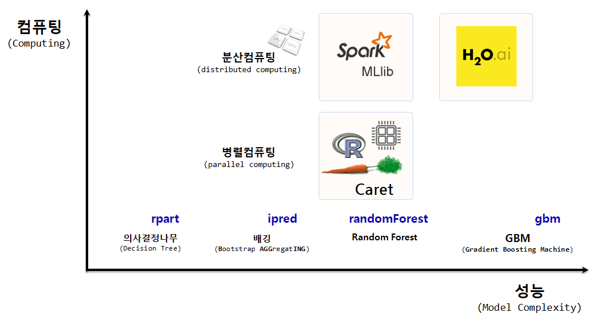

 

``` {r, include=FALSE}
source("tools/chunk-options.R")
knitr::opts_chunk$set(echo=TRUE, message=FALSE, warning=FALSE)

library(tidyverse)
library(skimr)
library(AER)        # 카드발급 데이터가 포함됨 
library(rpart)      # 재귀분할 나무모형
library(caret)      # 예측모형 플랫폼
library(Metrics)    # 예측모형 성능평가


```

## 1. 나무기반 모형 {#tree-based-machine-leanring-model}

나무기반 모형은 통계전문가 뿐만 아니라, 컴퓨터 과학자, 사업하시는 분들에게서 사랑받는 가장 대중적인 기계학습 모형중에 하나다.
단점이 없는 모형이 없지만, 나무기반 모형은 다음 측면에서 다른 모형에 비해서 비교우위에 있는 것은 분명하다.

- 해석용이성
- 사용하기 편리함
- 정확성
- 결측값 처리 불필요

예측모형의 성능은 분산(variance)과 편향(bias)를 모두 줄여야 하는데 이를 위해서 나무기반 강력한 모형이 수십년동안 개발되었다.

- 재귀적 분할(recursive partitioning): `rpart`
- 배깅 (Bagging, **B**ootstrap **AGG**regat**ING**): `ipred`
- 랜덤 포리스트(Random Forest): `randomForest`
- GBM(Gradient Boosting Machine): `gbm`  



## 2. 재귀적 분할(recursive partitioning) {#tree-based-model-rpart}

재귀적 분할 예측모형 개발을 위해서 사전에 몇가지 팩키지를 준비한다.

- tidyverse
- skimr
- rpart      : 재귀분할 나무모형
- caret      : 예측모형 플랫폼
- [Metrics](https://github.com/mfrasco/Metrics)    : 예측모형 성능평가

UCI 기계학습 저장소에서 신용승인 데이터 [Credit Approval Data Set ](http://archive.ics.uci.edu/ml/datasets/credit+approval)을 다운로드 받아
신용승인 변수를 예측변수로 설정하고 연속형 변수 다수를 변환시킨 후에 `caret` 팩키지를 사용해서 데이터를 훈련 데이터와 검증 데이터로 나누고 나서, 재귀분할 나무 모형에 적합시킨다.

``` {r tree-based-model-rpart}
# 0. 환경설정 -----------------
# library(tidyverse)
# library(skimr)
# library(AER)        # 카드발급 데이터가 포함됨 
# library(rpart)      # 재귀분할 나무모형
# library(caret)      # 예측모형 플랫폼
# library(Metrics)    # 예측모형 성능평가

# 1. 데이터 가져오기 ----------

credit_df <- read_csv("http://archive.ics.uci.edu/ml/machine-learning-databases/credit-screening/crx.data", col_names = FALSE)

credit_df <- credit_df %>% 
  rename(response=X16) %>% 
  mutate(response = factor(ifelse(response == "+", "yes", "no"), levels=c("no", "yes"))) %>% 
  mutate(X2 = as.numeric(X2),
         X3 = as.numeric(X3),
         X8 = as.numeric(X8),
         X11 = as.numeric(X11),
         X14 = as.numeric(X14),
         X15 = as.numeric(X15))

skim(credit_df)

# 2. 모형데이터 준비 ----------

train_index <- createDataPartition(credit_df$response, p=0.7, list=FALSE)

cc_train <-credit_df[ train_index,]
cc_test <- credit_df[-train_index,]

# 3. 재귀분할 나무모형 ----------

cc_rpart <- rpart(formula = response ~ ., 
                      data = cc_train, 
                      method = "class",
                      parms = list(split = "gini"))

# 4. 재귀분할 나무모형 평가 ----------
## 4.1. 예측
cc_rpart_pred <- predict(object = cc_rpart, 
                 newdata = cc_test,
                 type = "class")

## 4.2. 예측평가
ce(actual = cc_test$response, 
   predicted = cc_rpart_pred)

## 4.3. 재귀분할 나무모형 시각화
rpart.plot::rpart.plot(x = cc_rpart, yesno = 2, type = 0, extra = 0)
```

### 2.1. 재귀분할 나무모형 초모수(Hyper Parameter) {#tree-based-model-rpart-tuning}

재귀분할 나무모형에서 초모수로 `cp`, 복잡성모수(Complexity Parameter)를 선택하여 나무 가지치기(`prune`) 과정을 거쳐서 
최적의 모형을 구축하고 모형의 성능과 모형을 시각화하여 시각적 검증도 병행한다.

``` {r rpart-best-model}
# 5. 재귀분할 나무모형 초모수 설정 ---------------
## 5.1. CP 선정
optim_cp_key <- which.min(cc_rpart$cptable[, "xerror"])
optim_cp_value <- cc_rpart$cptable[optim_cp_key, "CP"]

## 5.2. 최적 재귀분할 나무모형 
cc_rpart_opt <- prune(tree = cc_rpart, 
                         cp = optim_cp_value)

## 5.3. 최적 재귀분할 나무모형 성능
cc_rpart_opt_pred <- predict(object = cc_rpart_opt, 
                         newdata = cc_test,
                         type = "class")

ce(actual = cc_test$response, 
   predicted = cc_rpart_opt_pred)

## 5.4. 최적 재귀분할 나무모형 시각화
rpart.plot::rpart.plot(x = cc_rpart_opt, yesno = 2, type = 0, extra = 0)
```

