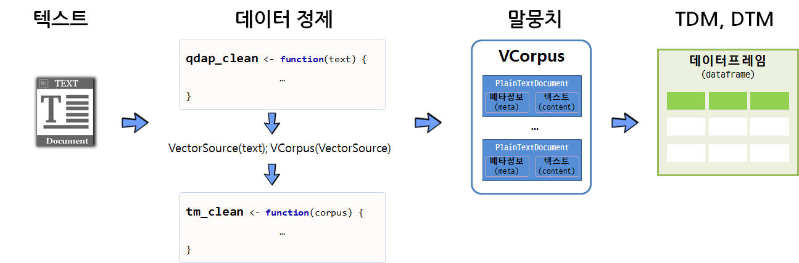
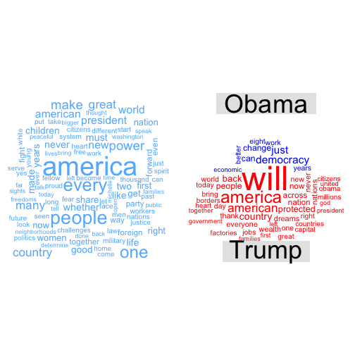
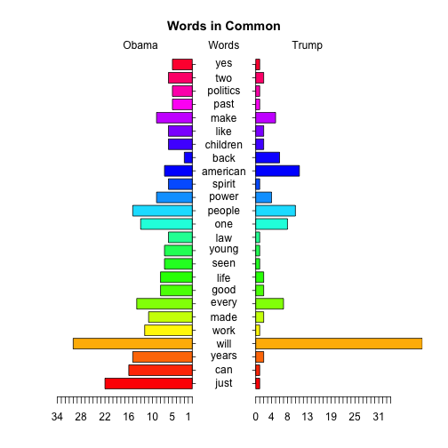

 

> ### 학습 목표 {.getready}
>
> * 텍스트 데이터 분석 작업흐름을 이해한다.
> * 단어주머니(Bag of Words) 모형을 이해한다.
> * 텍스트 데이터 전처리 과정의 핵심 팩키지 `tm`과 `qdap`을 활용한다.

## 1. 텍스트 분석 R 팩키지

- [tm](https://cran.r-project.org/web/packages/tm/) : 텍스트 마이닝 
- SnowballC : 어간추출(Stemming)
- ggplot2 : 시각화
- wordcloud : 단어구름

## 2. 텍스트 분석 작업흐름도

텍스트 데이터를 말뭉치(Corpus)로 변환하여 데이터를 분석하는 것도 가능하지만,
`qdap` 팩키지와 정규표현식의 기능을 적극 활용하여 가능하면 텍스트에서 전처리를 하고 나서,
말뭉치로 변환한 후에 `tm` 팩키지 정제기능을 활용하는 것도 가능하다. 물론 중복되는 부분도 있을 수 있으나 
빨래를 할 때 세탁기로 넣어 한 번 돌리고, 손빨래로 두번째 빨래를 깔끔하게 마무리하는 것으로 봐도 좋을 듯 하다.

깔끔한 말뭉치로 텍스트 데이터가 정제되고 나면 행렬로 변화시켜 다양한 통계 분석을 시작한다.

### 2.1. `qdap`, `tm` 텍스트 자료구조 비교

[텍스트 마이닝(Text Mining)](https://en.wikipedia.org/wiki/Text_mining)을 위한 R의 대표적인  팩키지가 `qdap` `tm` 이다.

| 팩키지명 |       원 텍스트         |       단어 빈도수(word counts)                          |
|----------|-------------------------|---------------------------------------------------------|
| **qdap** | 데이터프레임(Dataframe) |   단어 빈도 행렬(Word Frequency Matrix)                 |
| **tm**   | 말뭉치 (Corpus)         | 단어 문서행렬(Term Document Matrix)/문서 단어행렬(Document Term Matrix) |

[qdap](https://cran.r-project.org/web/packages/qdap/)은 원 텍스트 데이터를 데이터프레임 형태로 저장하는 반면에,
[tm](https://cran.r-project.org/web/packages/tm/) 팩키지는 `Corpus` 말뭉치 형태로 원 텍스트 데이터를 저장한다는 점에서 차이가 난다.

두 팩키지 모두 공통으로 사용하는 단어/용어 빈도수에는 행렬(`matrix`)을 사용한다. 이를 그림을 표현하면 다음과 같다.

* `qdap` 텍스트 원문 `qdap_dat` &rarr; `qview(qdap_dat)`
* `tm` 텍스트 원문 `tm_dat` &rarr; inspect(tm_dat)
* `qdap` 단어 빈도수 `qdap_wfm` &rarr; summary(qdap_wfm)
* `tm` 단어 빈도수 `tm_tdm` &rarr; inspect(tm_tdm)

### 2. `tm`, `qdap` 데이터 정제 기능

단어 주머니 기법을 활용하여 텍스트를 분석할 때, 데이터 정제를 통해 단어를 합산하는데 큰 도움이 된다.
영어 단어 예를 들어, statistics, statistical, stats 등은 모두 통계라는 한 단어로 정리되면 좋다.

`tm` 팩키지 및 `base` 팩키지에 내장된 데이터 정제 기능은 다음과 같다.

* tolower(): `base`에 포함된 함수로 모든 문자를 소문자로 변환.
* removePunctuation(): `tm`에 포함된 함수로 모든 구두점을 제거.
* removeNumbers(): `tm`에 포함된 함수로 숫자를 제거
* stripWhitespace(): `tm`에 포함된 함수로 공백(whitespace)을 제거 

`qdap`에는 좀더 다양한 텍스트 정제 함수가 지원된다.

* bracketX(): 괄호 내 모든 텍스트 제거 
    * "It's (very) nice" &rarr; "It's nice"
* replace_number(): 아라비아 숫자를 대응되는 영어문자로 변환
    * "7" &rarr; "seven"
* replace_abbreviation(): 축약어를 대응되는 전체 문자로 풀어냄
    * "Jan" &rarr; "Janunary"
* replace_contraction(): 단어 축약을 원래 상태로 되돌림
    * "can't" &rarr; "can not"
* replace_symbol(): 일반 기호를 대응되는 단어로 교체
     * "$" &rarr; "dollar"

텍스트가 너무 자주 출현하여 거의 정보를 제공하지 않는 단어를 **불용어(stop words)** 라고 부른다.
`tm` 팩키지에는 영어기준으로 174개 불용어가 등재되어 있다. 또한, 관심있는 주제로 문서를 모았다면 
수집된 거의 모든 문서에 특정 단어가 포함되어 있어 이것도 도움이 되지 않아 불용어에 등록하여 텍스트 
분석을 수행한다.

~~~{.r}
removeWords(text, stopwords("english"))
stop_words_lst <- c("rstudio", "statistics", stopwords("english"))
removeWords(text, stop_words_lst)
~~~

`stopwords("english")` 영어불용어 사전에 "rstudio", "statistics" 단어를 더해서 불용어 사전을 완성하고 나서 
removeWords() 함수로 새로 갱신된 사전에 맞춰 불용어를 정리한다.

### 2.2. 텍스트에서 말뭉치(Corpus)로 변환

텍스트 마이닝을 통해 데이터를 분석하려면 우선 원데이터가 텍스트 형태로 되어 있고 이를 말뭉치로 변환하여야 한다.
데이터가 벡터 형태(연설문 등) 혹은 데이터프레임 형태(트위터 트윗 등)에 따라 `VectorSource()`, `DataframeSource()` 함수를 적용하여 
**Source 객체**로 변형을 시킨다. 그리고 나서 `VCorpus()` 함수를 활용하여 말뭉치(Corpus)로 저장한다.
휘발성 말뭉치(Volatile Corpus, VCorpus)와 영구저장 말뭉치(Permanent Corpus, PCorpus)로 변환이 가능하다. 주로 `VCorpus`를 메모리에 적재하여 
텍스트 데이터 분석에 활용한다.

### 2.3. 말뭉치 정제 

텍스트를 말뭉치 객체로 저장시켜 놓으면, 말뭉치 정제 과정을 거치야 된다.
기본적으로 어떤 말뭉치 정제에 사용되는 기본 정제함수는 `tm` 팩키지를 활용하고,
추가적으로 `qdap` 팩키지 특수 말뭉치 정제 함수도 적극 활용한다.

### 2.4. 단어문서행렬(Term Document Matrix, TDM)

단어문서행렬을 통한 방법이 일반적으로 많이 사용된다. 이를 위해 입력값이 데이터프레임인 경우 `DataframeSource`,
벡터인 경우 `VectorSource`를 사용하여 말뭉치(Corpus)로 변환하고, 이를 `TermDocumentMatrix` 함수에 넣어 
단어문서행렬을 생성한다. 물론 텍스트를 바로 넣어 `wfm` 단어빈도행렬(Word Frequency Matrix)을 생성시켜 분석을 하기도 하지만 일반적인 방식은 아니다. 

`TermDocumentMatrix()` 함수를 활용하여 단어가 문서에 출현하는 빈도수를 행렬로 저장한다.
행렬형태 데이터를 저장하게 되면 고급 통계 분석이 가능하게 된다.
`DocumentTermMatrix()`는 `TermDocumentMatrix()` 함수로 통해 나온 행렬을 전치(transpose)시킨 것이다.
 
## 3. 텍스트 데이터 시각화 [^obama-farewell] [^trump-inauguration]

[^obama-farewell]: [Full Transcript: President Barack Obama’s farewell speech](http://www.vox.com/policy-and-politics/2017/1/10/14229878/full-transcript-president-barack-obama-farewell-speech)
[^trump-inauguration]: [Trump inauguration transcript 2017: Read the president full speech and remarks](https://mic.com/articles/166134/trump-inauguration-transcript-2017-read-the-president-s-full-speech-and-remarks#.VLFHVUrTE)

오바마 퇴임 연설문과 트럼프 취임 연설문을 통해 텍스트 데이터를 시각화한다.

### 3.1. 환경설정

`tm`, `qdap` 텍스트 데이터 전처리를 위한 팩키지를 불러오고, 텍스트 시각화를 위한 `wordcloud`, `plotrix` 팩키지도 가져오고,
데이터 전처리 함수를 두개 생성한다. 하나는 텍스트 수준에서 텍스트 데이터를 전처리하는 함수로 `qdap`에서 불러오고,
또 다른 함수는 `tm`에서 지원하는 함수로 중복되는 부분도 있다. 상황에 따라 편리한 함수를 활용한다.

~~~{.r}
# 0. 환경설정 -------------------------------------------------------
library(tm)
library(tidytext)
library(qdap)
library(tidyverse)
library(wordcloud)
library(tibble)
library(plotrix)
library(stringr)

clean_text <- function(text){
  text <- tolower(text)
  # text <- removeNumbers(text)
  # text <- bracketX(text)
  text <- replace_number(text)
  text <- replace_abbreviation(text)
  text <- replace_contraction(text)
  text <- replace_symbol(text)
  text <- removePunctuation(text)
  text <- stripWhitespace(text)
  text <- str_replace_all(text, "americans", "america")
  
  indexes <- which(text == "")
  if(length(indexes) > 0){
    text <- text[-indexes]
  } 
  return(text)
}

clean_corpus <- function(corpus){
  corpus <- tm_map(corpus, content_transformer(replace_abbreviation))
  corpus <- tm_map(corpus, stripWhitespace)
  corpus <- tm_map(corpus, removePunctuation)
  corpus <- tm_map(corpus, removeNumbers)
  corpus <- tm_map(corpus, removeWords, c(stopwords("en"), "Top200Words"))
  corpus <- tm_map(corpus, content_transformer(tolower))
  return(corpus)
}
~~~

### 3.2. 데이터 불러오기

오바마 퇴임식 연설문과 트럼프 취임식 연설문을 불러온다. 

~~~{.r}
# 1. 데이터 불러오기 -------------------------------------------------------
obama <- readLines("data/obama_farewell.txt", encoding = "UTF-8")
trump <- readLines("data/trump_inauguration.txt", encoding = "UTF-8")
~~~

### 3.3. 데이터 전처리

텍스트를 넣어 `qdap` 팩키지 전처리 함수를 조합한 `clean_text` 함수를 통해 텍스트 데이터를 정제하고 나서
말뭉치(Corpus)를 생성시키고 나서 이를 또다시 `clean_corpus` 함수로 정제한다. 그리고 나서, 
단어구름 시각화를 위한 데이터프레임 형태로 변환시킨다.

~~~{.r}
# 2. 데이터 전처리 -------------------------------------------------------
source("code/clean_fun.R")

make_corpus <- function(text) {
  text_clean <- clean_text(text)
  text_source <- VectorSource(text_clean)
  text_corpus <- VCorpus(text_source)
  corpus <- clean_corpus(text_corpus)
}

obama_corpus <- make_corpus(obama)
trump_corpus <- make_corpus(trump)

# 3. 말뭉치를 데이터프레임으로 변환 --------------------------------------

word_freq <- function(corpus) {
    doc_tdm <- TermDocumentMatrix(corpus)
    doc_m <- as.matrix(doc_tdm)
    doc_term_freq <- rowSums(doc_m)
    doc_word_freqs <- data.frame(term = names(doc_term_freq),
                             num = doc_term_freq) %>% arrange(desc(num))
    return(doc_word_freqs)
}

obama_word_freqs <- word_freq(obama_corpus)
trump_word_freqs <- word_freq(trump_corpus)
~~~

### 3.4. 텍스트 데이터 시각화

텍스트 데이터 시각화로 가장 많이 사용되는 단어구름(wordcloud)을 활용하여 
트럼프 취임 연설문과 오바마 퇴임 연설문을 시각화한다.
오바마 퇴임 연설문, 트럼프 취임 연설문 각각에 대한 단어구름을 생성시키고 나서,
두 연설문의 공통된 단어 및 두 연설문에 공통적으로 나타나지 않는 차이나는 단어를 시각화한다.

마지막으로 두 연설문의 공통적으로 나타나는 단어만 뽑아 피라미드 그래프를 통해 
공통적으로 언급하고 있으나 강도에 대한 부분을 시각화한다.

~~~{.r}
# 4. 시각화 --------------------------------------------------------------
## 4.1. 단어구름----------------------------------------------------------
par(mfrow=c(1,2))
blues <- brewer.pal(8, "Blues")[-(1:2)]
wordcloud(obama_word_freqs$term, obama_word_freqs$num, max.words=100, colors=blues)

reds <- brewer.pal(8, "Reds")[-(1:2)]
wordcloud(trump_word_freqs$term, trump_word_freqs$num, max.words=100, colors=reds)
~~~

~~~{.r}
## 4.2. 공통 단어구름

all_obama <- paste(obama, collapse = " ")
all_trump <- paste(trump, collapse = " ")

obama_trump <- c(all_obama, all_trump)

obama_trump_corpus <- make_corpus(obama_trump)
obama_trump_word_freqs <- word_freq(obama_trump_corpus)

obama_trump_tdm <- TermDocumentMatrix(obama_trump_corpus)
obama_trump_m <- as.matrix(obama_trump_tdm)

commonality.cloud(obama_trump_m,  colors ="steelblue1", max.words=100)

## 4.3. 비교 단어구름
colnames(obama_trump_tdm) <- c("Obama", "Trump")
obama_trump_df <- as.matrix(obama_trump_tdm) %>% as.data.frame()

comparison.cloud(obama_trump_df, colors = c("blue", "red"), max.words = 50)
~~~

~~~{.r}
## 4.4. 피라미드 그래프
par(mfrow=c(1,1))

common_words_25 <- obama_trump_df %>% 
  mutate(label = rownames(obama_trump_df)) %>% 
  dplyr::filter(Obama > 0 & Trump >0) %>% 
  mutate(diff = abs(Obama - Trump)) %>% 
  arrange(desc(diff)) %>% slice(1:25)

plotrix::pyramid.plot(common_words_25$Obama, common_words_25$Trump,
             labels = common_words_25$label, gap = 8,
             top.labels = c("Obama", "Words", "Trump"),
             main = "Words in Common", laxlab = NULL, 
             raxlab = NULL, unit = NULL)
~~~

~~~{.output}
[1] 5.1 4.1 4.1 2.1

~~~

### 참고문헌 

* [Tyler W. Rinker, qdap-tm Package Compatibility](https://cran.r-project.org/web/packages/qdap/vignettes/tm_package_compatibility.pdf)
* [Basic Text Mining in R](https://rstudio-pubs-static.s3.amazonaws.com/31867_8236987cf0a8444e962ccd2aec46d9c3.html)
* [Hands-On Data Science with R Text Mining, Graham.Williams](http://onepager.togaware.com/TextMiningO.pdf)
* [Natural Language Processing Tutorial](http://www.vikparuchuri.com/blog/natural-language-processing-tutorial/)
* [slides from my R tutorial on Twitter text mining](https://jeffreybreen.wordpress.com/2011/07/04/twitter-text-mining-r-slides/)

* [Statistics meets rhetoric: A text analysis of "I Have a Dream" in R](http://anythingbutrbitrary.blogspot.kr/2014/01/statistics-meets-rhetoric-text-analysis.html)
* [How to Create WordCloud of Twitter Data using R Programming](http://technokarak.com/how-to-create-wordcloud-of-twitter-data-using-r-programming.html)
* [How to Clean the Twitter Data using R – Twitter Mining Tutorial](http://technokarak.com/how-to-clean-the-twitter-data-using-r-twitter-mining-tutorial.html)
* [How to Load Twitter Tweets in R Environment](http://technokarak.com/how-to-load-twitter-tweets-in-r-environment.html)
